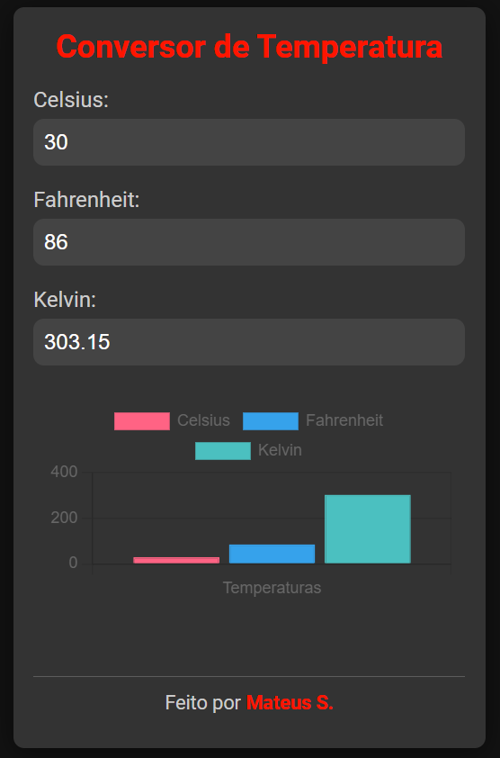

# Conversor de Temperatura - React

Um conversor de temperatura simples e moderno, desenvolvido com React, apresentando visualização de dados em tempo real com gráficos interativos.

## Funcionalidades

Converte entre Celsius (°C) e Fahrenheit (°F)  
Gráfico de barras interativo para comparação de temperaturas  

## Imagens

*Acima está uma captura de tela da aplicação.*

## Como Usar

Insira um valor de temperatura no campo de entrada.  
Escolha a unidade de conversão (°C ou °F).  
Veja a temperatura convertida em tempo real.  
Confira o gráfico interativo para visualização.  

## Créditos

Desenvolvido por Mateus S.  
GitHub: [Matz-Turing](https://github.com/Matz-Turing)
